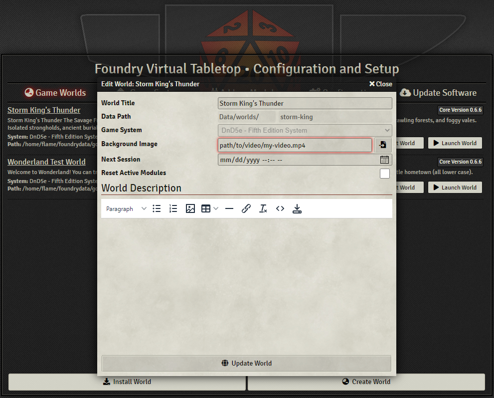

# Dragon Flagon Mods for Foundry VTT

## DF User Logger
User login/logout module that adds an expiring message to the chat log when a user logs in/out of the server.

## Login Screen Animated Background Script (TamperMonkey)
*Requires the TamperMonkey extension on individual each viewing browser to work*

### How to install (Everyone)

- Install [TamperMonkey Extension](https://www.tampermonkey.net/) for your browser
- Click the TamperMonkey extension and select "Dashboard" from its menu.
- Select the "Utilities" tab
- Copy and paste this URL into the "Install from URL" field
  `https://raw.githubusercontent.com/flamewave000/dragonflagon-fvtt/master/fvtt-login-anim-bg.js`
- Click Install
- Click Install again on the confirmation page

### How to use (GM only)

- In the regular background image field of the World settings, simply enter in the URL for the video.
- Click "Update World", launch your world and enjoy the view.

#### With Background Image Backup
- Upload your video into the same directory as your normal background image.
- Give it an identical name (except for the extension)
  `path/to/my-loginscreen.jpg`
  `path/to/my-loginscreen.mp4`
- In the World Config, select your image file and save.

The script will see the image URL and attempt to load a video of the same path and name but with the extension as .mp4 or .m4v

### Adjust Video Scaling/Fit

You can add a flag at the end of the URL that allows for selecting a different option for scaling the video. This is in the format: `path/video.mp4?OPTION` or `path/image.jpg?OPTION`
For Example:
  `path/to/my-video.mp4?fill`
  `path/to/my-image.jpg?fill`

The script will extract that flag from the URL and apply it to the video player. The available options are as follows:
- **`cover` (default):** The video is sized to maintain its aspect ratio while filling the screen's entire area. The object will be clipped to fit.
- **`fill`:** The video is sized to fill the screen's entire area. If necessary, the object will be stretched or squished to fit.
- **`contain`:** The video is scaled to maintain its aspect ratio while fitting within the screen's area.
- **`scale-down`:** The video is sized as if `none` or `contain` were specified (would result in a smaller video size).
- **`none`:** The video is not resized.