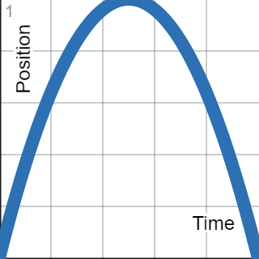

# DragonFlagon Active Lights

  

This module provides a way to animate all the various configurations of a light. This animation will be synchronized with the server so that all players should see the same animation states. A simple example for this would be for creating a simple Light House where the light's direction would animate all the way around a 180° rotation. The configuration window for Active Lights can be opened from the Light Animation tab in any Ambient Light config window.

## Animation Functions

The way animations work is that at time T, the position along the transition is at a deterministic position along a mathematical curve. This is some really fancy talk for basically making a dot follow a line.

Take this animation for example:
- Key Frame: 0 Seconds
	- Bright Radius: 0 feet
- Key Frame: 2 Seconds
	- Bright Radius: 40 feet

Given a Linear animation, the following are the results over time:
|0s|0.25s|0.5s|0.75s|1s|
|:-:|:-:|:-:|:-:|:-:|
|0 ft|10 ft|20 ft|30 ft|40 ft|

The same key frames but with an Elliptic Animation would have these results:
|0s|0.25s|0.5s|0.75s|1s|
|:-:|:-:|:-:|:-:|:-:|
|0 ft|15.31 ft|28.28 ft|36.96 ft|40 ft|

Here are all of the animation functions that are available, along with a graph for each.

| Name | Graph | Name | Graph | Name | Graph |
| -: | - | -: | - | -: | - |
| Linear           |            | Quadratic&nbsp;In   |      | Elliptical&nbsp;In   |      |
| Linear&nbsp;Loop |  | Quadratic&nbsp;Out  |    | Elliptical&nbsp;Out  |    |
| Fixed&nbsp;Start |  | Quadratic&nbsp;Full |  | Elliptical&nbsp;Full |  |
| Fixed&nbsp;End   |      | Quadratic&nbsp;Loop |  | Elliptical&nbsp;Loop |  |

** If you want to support me or just help me buy doggy treats! Also, you can keep up to date on what I'm working on. I will be announcing any new modules or pre-releases there for anyone wanting to help me test things out!**

## Changelog

You can find all the latest updates [in the CHANGELOG](./CHANGELOG.md)