# DragonFlagon Chat Enhancements

  [](https://www.foundryvtt-hub.com/package/df-chat-enhance/)

Multiple improvements to the chat system feature set. Brings a new Chat Archive that lets you save your current chat log to an archive and keep the chat clean between sessions. Gives an option to replace the Roll Type dropdown menu with a set of 4 buttons. This makes switching rolls much more efficient and provides a better visual indicator for what roll you're in.

## Contributers

- Code Contributions: [zeteticl](https://github.com/zeteticl).
- Code Contributions: [hmqgg](https://github.com/hmqgg)
- Japanese Localization: Tonishi & [BrotherSharper](https://github.com/BrotherSharper)
- Korean Localization: [drdwing](https://github.com/drdwing)
- Portuguese (Brazil) Localization: [Brn086](https://github.com/Brn086) and [Matheus Clemente](https://github.com/mclemente)
- Helping me Fix my dumb mistakes with libWrapper 🤣: [ruipin](https://github.com/ruipin)

## Table of Contents

- [Adventure Log](#Adventure-Log)
	- [Config](#Config)
	- [Log Command Help](#Log-Command-Help)
	- [Log Commands](#Log-Commands)
	  - [GM Only Log](#GM-Only-Log)
	  - [Right-Click Add to Log](#Right-Click-Add-to-Log)
	  - [Quote Sources](#Quote-Sources)
- [Roll Selector Buttons](#roll-selector-buttons)
- [Chat Archive](#Chat-Archive)
	- [Create Archive](#Create-Archive)
		- [Create Chat Archive Window](#Create-Chat-Archive-Window)
	- [Manage Chat Archives](#Manage-Chat-Archives)
		- [Edit Archive Name](#Edit-Archive-Name)
		- [Delete Messages](#Delete-Messages)
		- [Archive Merging](#Archive-Merging)
- [Edit Sent Messages](#Edit-Sent-Messages)
	- [Edit Last Message Keyboard Shortcut](#Edit-Last-Message-Keyboard-Shortcut)
- [Better Chat Log Scrolling](#Better-Chat-Log-Scrolling)
- [Chat Message Merging](#Chat-Message-Merging)
	- [Message Headers](#Message-Headers)
	- [Message Divider](#Message-Divider)
	- [Hover Shadow](#Hover-Shadow)
	- [Roll Merging](#Roll-Merging)
- [Whisper Recipient List Truncation](#Whisper-Recipient-List-Truncation)
- [Third-Party Libraries](#Third-Party-Libraries)

**[](https://www.patreon.com/bePatron?u=46113583) If you want to support me or just help me buy doggy treats! Also, you can keep up to date on what I'm working on. I will be announcing any new modules or pre-releases there for anyone wanting to help me test things out!**

## More Efficient Chat History

By default, FoundryVTT only loads messages as you scroll up through the history in the Chat Log. The only problem is that once the messages have been loaded, they stay there for the entirety of the session unless you reload the page. I always found that Foundry would continue to gradually slow down as time went on and the chat log filled up more and more.

Instead, DF Chat Enhancements will actively monitor the scroll position and automatically unload chat messages based on a maximum history size. This way, as more and more messages are added to the Chat Log, old messages will be removed to help reduce FoundryVTT's memory and cpu usage.

## Adventure Log

You can now enable the Adventure Log feature for easy in-game event tracking. This feature adds the new chat command `/log` that allows you to quickly add a note about something that has just happened. This command will save the event message as an entry in a designated journal. It will be formatted with a timestamp, and who made the entry.

### Config

Access the config through the settings, or by entering `/log config` into the chat window. This is where you can set the target Journal for Adventure Log entries. It also gives you an option to erase the contents of the Journal. Either way, it will add a new section with a header label "Adventure Log" and will contain the logged entries.

**It is NOT recommended for you to change anything in the section between the header and the horizontal line that denotes the end of the log**

 

### Log Command Help

At any time you can simply enter `/log` into the chat to display the help dialog

### Log Commands

| Name | Command | Description |
| --- | --- | --- |
| General Event | `/log ...message`<br />`/log e ...message`<br />`/log event ...message` | Logs a simple event message to the adventure log. |
| Quote | `/log q <source> ...message`<br />`/log quote <source> ...message`<br />`/log q "<source with spaces" ...message`<br />`/log quote "<source with spaces" ...message` | Adds an entry Quote of the "Source". |

#### Player Log

Players can be assigned their own personal Adventure Log. This can be assigned in the User Config, and can be written to with the `/plog` command.

#### GM Only Log

For any of the above commands, you can use `/gmlog` instead and the event/quote will be sent to the GM Only Adventure Log instead.


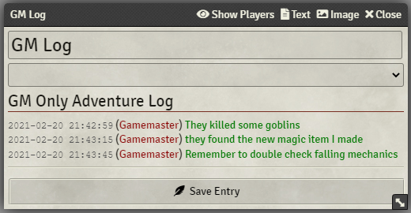
 

#### Right-Click Add to Log

You can right-click chat messages to add their contents as an Event or as a Quote. When adding as a quote, it will use the original message's sender as the [Quote Source](#Quote-Sources)

#### Quote Sources

You do not need to add quotes around the Source Name, unless there are spaces in the name. Such as the following:
`/log q Bobby McFerrin Don't worry, be happy!`
Will output into the log

> [2021-02-12 4:35PM] (Susan) Bobby said: "McFerrin Don't worry, be happy!"

Instead if you add quotes around the name, it will allow the spaces.
`/log q "Bobby McFerrin" Don't worry, be happy!`
Will output into the log

> [2021-02-12 4:35PM] (Susan) Bobby McFerrin said: "Don't worry, be happy!"

### Macro API

You can post messages to the Adventure Logs using a custom Macro. To do so, simply use the following:

```JavaScript
// Log an Event to the Adventure Log
AdventureLog.event("Something happened!")
// Log an Event to the Player Log
AdventureLog.pevent("Something happened!")
// (GM Only) Log an Event to the GM Adventure Log
AdventureLog.gmevent("The players did something!")
// Log a Quote to the Adventure Log
AdventureLog.quote("Bob", "Don't worry, be happy!")
// Log a Quote to the Player Log
AdventureLog.pquote("Bob", "Don't worry, be happy!")
// (GM Only) Log a Quote to the GM Adventure Log
AdventureLog.gmquote("Bob", "Don't worry, be happy!")

// If you want the event/quote posted to the chat, add "true" to the call
AdventureLog.event("Something happened!", true)
AdventureLog.pevent("Something happened!", true)
AdventureLog.quote("Bob", "Don't worry, be happy!", true)
AdventureLog.pquote("Bob", "Don't worry, be happy!", true)

// (GM Only) GM logs will be whispered to yourself
AdventureLog.gmevent("The players did something!", true)
AdventureLog.gmquote("Bob", "Don't worry, be happy!", true)
```

## Roll Selector Buttons 

| Players | Game Masters |
| :-: | :-: |
| 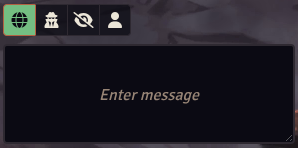 | 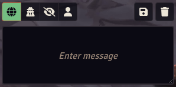 |

| Roll Type | Button | Keyboard Shortcut |
| - | - | :-: |
| Public Rolls |  | <kbd>Alt</kbd> `+` <kbd>Q</kbd> |
| Private GM Rolls |  | <kbd>Alt</kbd> `+` <kbd>W</kbd> |
| Blind GM Rolls |  | <kbd>Alt</kbd> `+` <kbd>E</kbd> |
| Self Rolls |  | <kbd>Alt</kbd> `+` <kbd>R</kbd> |

## Chat Archive

The chat archive is a large component of this module. It allows you to save either all of your current messages, or a selected date range of messages. When you save the messages, you can choose to have them automatically deleted from the chat log. Once you have an archive, you can go to the settings tab and click the new "Manage Chat Archive" button to see your archives. Simply click any archive and it will open a viewer window where you can see the old chats!

### Create Archive

To create an archive, simply click the new "Archive chat log" button that is now beside the "save" and "delete" buttons in the chat sidebar. 

#### Create Chat Archive Window

|All chats|Date range of chats|
|:-:|:-:|
|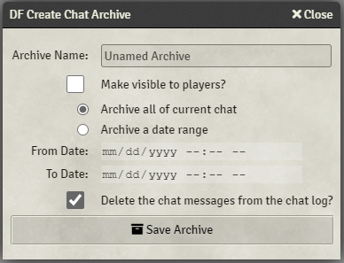||

The windows is fairly self explanatory, you can select all the current chat messages for archiving, or you can select a local date range.

### Manage Chat Archives

You can view and delete archives from the archive manager. You'll find the  button in the sidebar settings tab. You can also see which ones are visible to your players

#### Edit Archive Name

GMs will see a simple Pencil icon next to the Archive's name. Clicking this will open the name editing dialog.

#### Delete Messages

GMs will see the typical Trash Can button on archived messages that allows them to delete them individually.

#### Archive Merging

When viewing a Chat Archive, GMs will see a Merge button in the top right corner. This button presents a Dialog where you can select one of your other archives which can be merged into the one currently being viewed. It also gives a checkbox that if checked will delete the other archive that is being merged into the currently viewed one.

|Manage Archives|View Archive|Edit Archive Name|Archive Merge|
|:-:|:-:|:-:|:-:|
|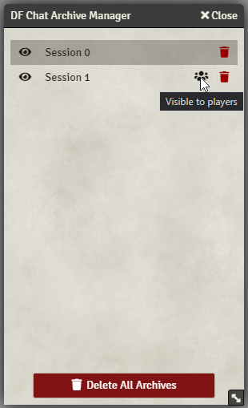|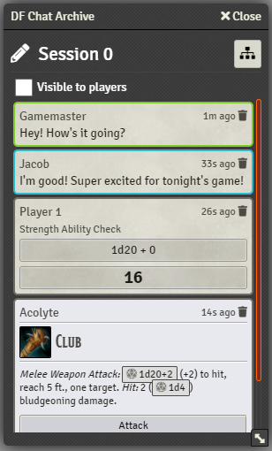|||

## Chat Message Markdown

You can now use all of your favourite Markdown in the Chat Log for formatting your messages in the way you want.

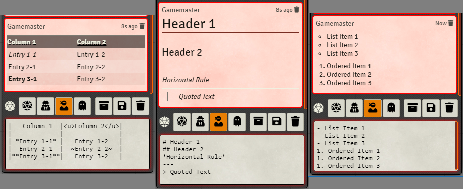

## Edit Sent Messages

You will now see a little edit button in the top right of messages you are allowed to edit. Clicking this will display a dialog that lets you change the contents of the message. It will also add the "(edited)" flavour to the message to show that it has been modified.

### Edit Last Message Keyboard Shortcut

A keyboard shortcut has now been added to allow you to quickly edit your most recent message you sent. While in the chat box, simply press `[Ctrl]+[Up]` on the keyboard. An edit message dialog will immediately appear for the most recent message you sent.


## Better Chat Log Scrolling

Currently in Foundry if you scroll up through the chat log, it will automatically jump back down as soon as someone posts a message or makes a roll. This can be frustrating if you're trying to find something mid-game.

This feature prevents that auto-scroll and instead will give you a "Scroll To Bottom" button that you can click to quickly get back down. Also, if new messages are posted to the chat, the button will pulse and say "New Message!" on it.

|Scroll To Bottom Button|Scroll To Bottom with New Message|
|:-:|:-:|
|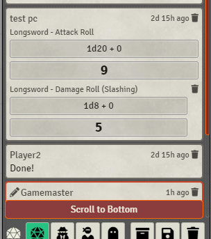||

## Chat Message Merging

You will now be able to have messages merged in the chat. There are various settings for customizing the look and feel of the chat merges.

|Chat Merging GM|Chat Merging PC|
|:-:|:-:|
|||

### Message Headers

By default, the message headers of merged messages are hidden (except for the top message). These headers contain the delete button for GMs, the timestamp for the message, and (if you have it enabled) the edit button for the message. By default, the headers will not be shown in order to keep things more compact. But there is an option to show the headers in the module settings. When headers are hidden, GMs will still be able to see the Delete button for messages, it will just be shifted down and the message content given a small padding on the right.

### Message Divider

There is an option for merged messages to display a thin divider between them. This adopts the border colour of the messages.

|With Divider|Without Divider|
|:-:|:-:|
||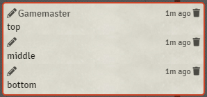|

### Hover Shadow

Merged Messages are set to display a faint shadow when you hover over them. I recommend you keep this on if you have the [Message Divider](#Message-Divider) feature disabled.

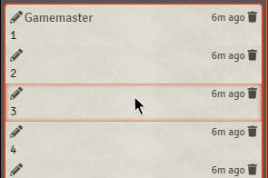

### Roll Merging

Rolls can be merged in an independent way. You have three choices, No Merging, Merge with other Rolls, and Merge With Any. Below demonstrates the visual differences between the three options:

|No Merging|Merge with other Rolls|Merge With Any|
|:-:|:-:|:-:|
||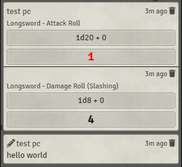||

## Chat Box Send Button

*This feature OFF by default, but can be turned on in the module settings.*

Displays a Send Message button in the chat box. This button can be clicked to send the currently written message. This is useful for anyone using a touch screen, or just prefers using a mouse to send the message instead of hitting Enter.

## Simple Calendar Chat Message Timestamps

There is an option that when enabled, you will see the chat message timestamp changed from real-world time to one based on the current Game Time. The format of this timestamp is provided by the Simple Calendar module, which must be installed in order to use this feature.

## Whisper Recipient List Truncation

Now when you whisper a message to a list of users, the Recipient List at the top of the message is truncated if it is too long. There are some games that have many GM users and hitting up `/w gm ...` can make a very massive chat message. Instead it will truncate the list and say how many more names there are. You simply have to hover your mouse over the visible names and the rest will show in the mouse-over hint bubble.


## Formatted Message Text Selectable

Core Foundry prevents the selection of text in ANY part of Foundry. This means sections need to be re-enabled for user text selection. Messages currently allow it, but only for the plain text part. If you attempt to select "formatted" or stylized text such as this: `"Hello, my name is <b>Bob</b>"`. The `<b>` makes the text "Bob" bold, and cannot be selected. DF Chat Enhancements makes it possible to select any and all text within a regular message (any message that is not a Roll).

## Third-Party Libraries

- `marked.min.js` - a markdown parser
	> Copyright (c) 2011-2021, Christopher Jeffrey. (MIT Licensed)
	> https://github.com/markedjs/marked