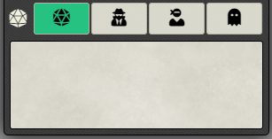
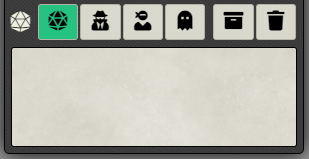
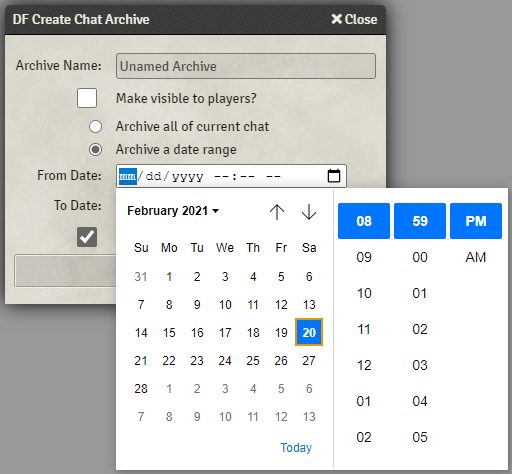

# DragonFlagon Chat Enhancements

Multiple improvements to the chat system feature set. Brings a new Chat Archive that lets you save your current chat log to an archive and keep the chat clean between sessions. Gives an option to replace the Roll Type dropdown menu with a set of 4 buttons. This makes switching rolls much more efficient and provides a better visual indicator for what roll you're in.

- [Roll Selector Buttons](#roll-selector-buttons)
- [Chat Archive](#Chat-Archive)
	- [Create Archive](#Create-Archive)
		- [Create Chat Archive Window](#Create-Chat-Archive-Window)
	- [Manage Chat Archives](#Manage-Chat-Archives)
	- [Future planned archive features](#Future-planned-archive-features)
- [Future Module Features](#Future-Module-Features)

#####  If you want to support me or just help me buy doggy treats! Also, you can keep up to date on what I'm working on. I will be announcing any new modules or pre-releases there for anyone wanting to help me test things out!

## Roll Selector Buttons

| Players | Game Masters |
| :-: | :-: |
|  |  |

| Roll Type | Button |
| - | - |
| Public Rolls |  |
| Private GM Rolls |  |
| Blind GM Rolls |  |
| Self Rolls |  |

## Chat Archive

The chat archive is a large component of this module. It allows you to save either all of your current messages, or a selected date range of messages. When you save the messages, you can choose to have them automatically deleted from the chat log. Once you have an archive, you can go to the settings tab and click the new "Manage Chat Archive" button to see your archives. Simply click any archive and it will open a viewer window where you can see the old chats!

### Create Archive

To create an archive, simply click the new "Archive chat log" button that is now beside the "save" and "delete" buttons in the chat sidebar. 

#### Create Chat Archive Window

|All chats|Date range of chats|
|:-:|:-:|
|||

The windows is fairly self explanatory, you can select all the current chat messages for archiving, or you can select a local date range.

### Manage Chat Archives

You can view and delete archives from the archive manager. You'll find the  button in the sidebar settings tab.

|Manage Archives|View Archive|
|:-:|:-:|
|||

### Future planned archive features

- Delete individual messages from an archive.
- Rename an archive.
- Combine two archives together (sorted by time and removing any duplicate entries).

## Future Module Features

- Edit sent chat messages if you are the owner (not including roll chats) [Trello: Edit Chat messages if owner](https://trello.com/c/R2Zw8HGh/72-edit-chat-messages-if-owner)
- Add chat to journal command. [Trello: Game Logger (chat-to-journal)](https://trello.com/c/HiUp32yb/223-game-logger-chat-to-journal)