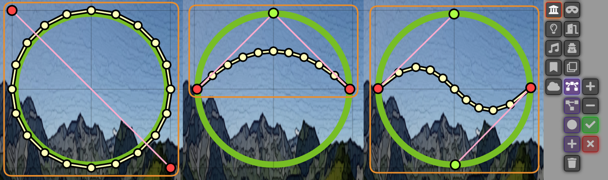
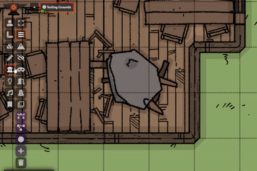
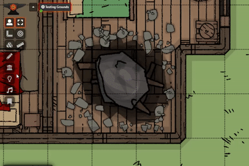
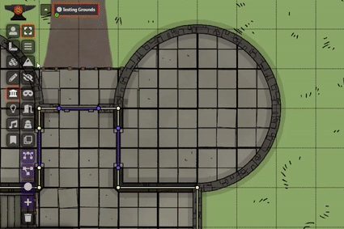
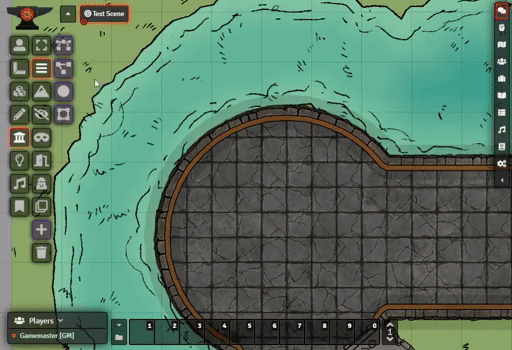
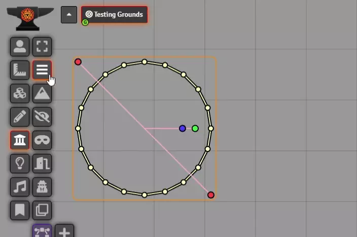

# DragonFlagon Curvy Walls

  

Adds Bezier Curves and Ellipse tools to the walls layer. This gives you the ability to generate wall segments along a curve quickly and easily. You can also increase or decrease the number of wall segments used along the curve.

| Cubic Bezier Curve | Quadratic Bezier Curve |
| :-: | :-: |
|  |  |

| Ellipse With Slicing | Rectangle with Segmented Sides |
| :-: | :-: |
|  |  |

#####  If you want to support me or just help me buy doggy treats! Also, you can keep up to date on what I'm working on. I will be announcing any new modules or pre-releases there for anyone wanting to help me test things out!

## Dismiss Current Tool Shortcut

You can quickly remove and disable the current tool by <kbd>Ctrl</kbd>&nbsp;+&nbsp;<kbd>Right-Click</kbd>ing anywhere on the screen. This is useful if you've just placed a curved wall and want to jump back into making regular walls again without having to go and click the tool's toggle button.

## Bezier Curves

Supports both a Quadratic and Cubic curve to give differing forms of curve generation. The Quadratic curve may be of very niche use but gives a very fast way to create a simple curve. The Cubic curve is very powerful though, and provides a great to create "just the right" curve.

## Ellipse Curve

Generates a simple ellipse that can be squished and stretched. You can cut a "slice" out of the ellipse to create an opening, and you can specify the arc offset of the walls so the segments are position at the right point along the curve.

You can place a perfect circle by holding the <kbd>Alt</kbd> key while placing or adjusting the ellipse tool.

You can have the tool grow the circle out from a center point by holding the <kbd>Ctrl</kbd> key while placing the ellipse tool. Useful if you know where the center of a room is and just want to grow the wall tool out from there.

## Rectangle Tool

Generates walls in a rectangle. This also allows you to specify the number of segments for each side, including having a side with no walls!

You can place a perfect square by holding the <kbd>Alt</kbd> key while placing or adjusting the ellipse tool.

You can have the tool grow the rectangle out from a center point by holding the <kbd>Ctrl</kbd> key while placing the ellipse tool. Useful if you know where the center of a room is and just want to grow the wall tool out from there.

## Shape Tracing

For the Quadratic Bezier Curve, Ellipse, and Rectangle tools, you can now plot points along the shape to fit the placement tool to. Unfortunately Cubic Bezier curves can not be easily approximated, and therefore it is not traceable. Also, ellipses cannot be generated by fewer than 5 points and each points needs to be precisely placed, so the trace tool will only generate perfect circles using 2 points (the first being the center and the second being the edge) or 3 points (all three points are on the edge of the circle).

To place points, simply <kbd>Left-Click</kbd> on the canvas. You can also drag an existing point by <kbd>Left-Click Drag</kbd>. To remove a point, simply <kbd>Ctrl</kbd>&nbsp;+&nbsp;<kbd>Left-Click</kbd>

## Move or Place Most Recent Configuration

If you have configured a tool to match that perfect circle for a tower but have a couple more identical towers to do, you can simply <kbd>Ctrl</kbd>&nbsp;+&nbsp;<kbd>Left-Click</kbd> the canvas to place the tool using the most recent configuration.

## Uses the Current Wall Type Selection

## Community Libraries Used

- BezierJS by Pomax [[Project](https://pomax.github.io/bezierjs)] [[Repositiory](https://github.com/Pomax/bezierjs)]

## Contributors

- [José E. Lozano (Viriato139ac#0342)](https://github.com/lozalojo): Spanish localization
- Touge & [BrotherSharper](https://github.com/BrotherSharper): Japanese localization

## Changelog

You can find all the latest updates [in the CHANGELOG](./CHANGELOG.md)

---
---

## Building the module
This module requires NPM in order to be compiled as it uses TypeScript and Gulp.
- Make sure you have NPM installed: [Get NPM](https://www.npmjs.com/get-npm)
- Open a terminal in the module directory `/path/to/repo/dragonflagon-fvtt/df-curvy-walls/`
- Run the following `npm install`
- After that finishes you can simply run `npx gulp`
- You will find the compiled module in the now available `dist/` folder.

### Auto-deploy to local FoundryVTT
If you want to have the compiled module output to the FoundryVTT installation instead of to the `dist/` folder, you can do the following:
- Open the `package.json` file.
- Change the `"devDir": "..."` value to your own installation of Foundry's module folder.
- Run the following command `npx gulp dev` to build the project and have the result copied to your Foundry Modules folder.
