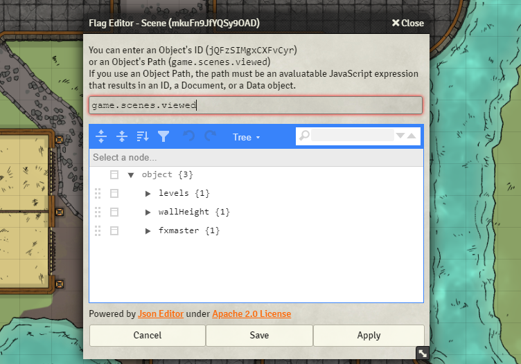

# DragonFlagon Flag Editor
  

Provides a useful way for module and macro developers to view and edit the flags of an object. Simply provide the object's ID or a JavaScript Expression that results in an ID, Document, or Data Object.

#####  If you want to support me or just help me buy doggy treats! Also, you can keep up to date on what I'm working on. I will be announcing any new modules or pre-releases there for anyone wanting to help me test things out!

## Changelog

You can find all the latest updates [in the CHANGELOG](./CHANGELOG.md)