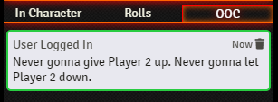
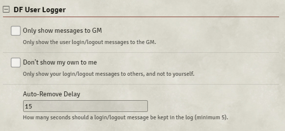

# DF User Login

Sends an OOC whisper to all users when someone logs in. These messages have a lifetime and will self-delete after a specified amount of time. These messages currently use the same quotes that are used by Discord for when a user joins a server. There is also a message sent when a user logs out of the game.

#####  If you want to support me or just help me buy doggy treats! Also, you can keep up to date on what I'm working on. I will be announcing any new modules or pre-releases there for anyone wanting to help me test things out!

## Message

## Settings

- **(GM Only) Only show messages to GM:** The whispers will only be seen by the GameMaster in the server.
- **(GM Only) Auto-Remove Messages:** The GM can turn off the auto-destruct feature so log messages are perminent.
- **(All) Auto-Remove Delay:** Users can set how long a message lives in their feed before it deletes itself.
- **(All) Don't show my own to me:** Users can have their login message show to others but not themselves.

## Future Features:

- Add ability to allow GM to manage the login/logout messages from within settings.

## Contributors

- [José E. Lozano (Viriato139ac#0342)](https://github.com/lozalojo): Spanish localization

## Changelog

You can find all the latest updates [in the CHANGELOG](./CHANGELOG.md)