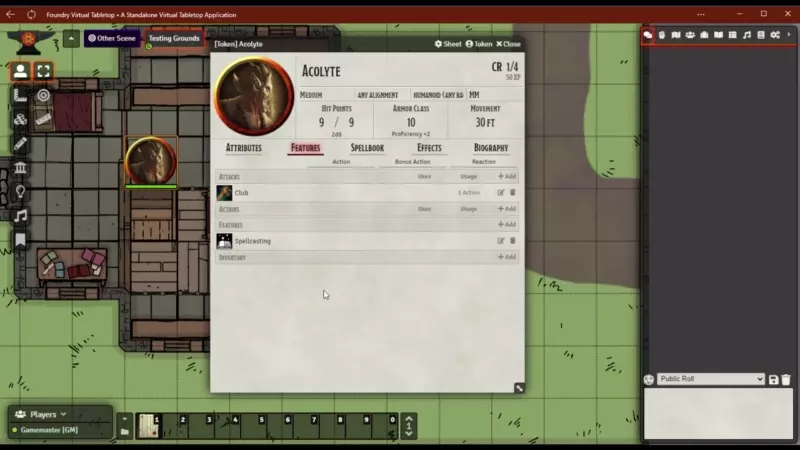
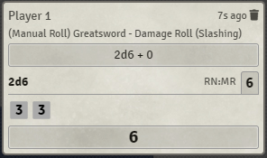
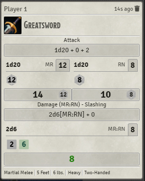

# Dragon Flagon Manual Rolls

Allows you to manually enter the individual dice results when making any kind of roll. This can be great for both testing your game (where you want to roll a specific number) or if you want to use real dice! and let Foundry figure out the math.

Given the limitations of Foundry around Rolling (namely that rolls are not Asynchronous) it is difficult to really do any kind of overhaul of the roll system. But I've found a way using good ol' fashioned prompts!

---

## Flavour Text - *DnD 5e Only*

For the DnD 5e system you will be able to get flavour text in the prompts that describe the purpose of the roll. This feature is incompatible with other systems which will just show the regular generic prompt. Flavour text will also not be reliable with any major rolling overhauler module like BetterRolls and Midi QoL as these change how the core rolls are reported.
***Support for other systems will depend on demand***

---

## Manual Roll Flagging in Chat

Manual rolls can be flagged to show not only which chat card has manual rolls in it, but specifically which dice were manually rolled, and which were randomly generated by FoundryVTT. This works for BetterRolls as well.

- **MR**: Manual Roll
- **RN**: Random Number

These indicators will be in the same order as the dice rolls. So in the BetterRolls example below, the `2` is a Manual Roll(MR) and the `6` is a Random Number (RN).

|Core FoundryVTT|BetterRolls|
|:-:|:-:|
|||

## Limitations

❌ **It will NOT work inside the Foundry Desktop App. The module will only work inside a Browser.**

Unfortunately, Electron (what the Foundry app is built on) does not support all ***web standards*** 🤦‍♂️ In this case they have not implemented the `prompt` dialog (even though they have the `alert` and `confirm` dialogs implemented 🤷‍♂️). So as long as you are playing in any regular browser (Brave, Edge, Firefox, Chrome, etc.) the module will work fine.

## Potential Conflicts

There is always a potential conflict with any other module that modifies rolls. As of right now, the following popular modules have been tested and do not appear to have any issues. But if any do, please let me know via Discord or log an issue on GitHub.

**Tested Dice Modules (✅ Works, ❌ Conflicts)**

- ✅ Better Rolls
- ✅ Midi Quality of Life Improvements
- ✅ Dice So Nice!
- ✅ Dice Tray
- ✅ Let Me Roll That For You

---

#####  If you want to support me or just help me buy doggy treats! Also, you can keep up to date on what I'm working on. I will be announcing any new modules or pre-releases there for anyone wanting to help me test things out!
