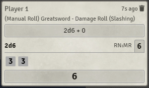
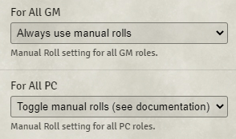
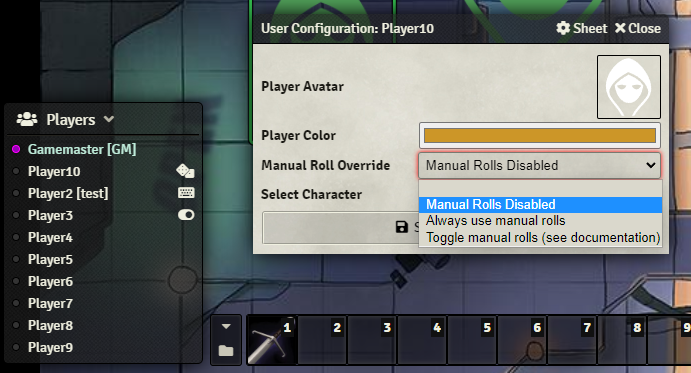

# Dragon Flagon Manual Rolls

  

Allows you to manually enter the individual dice results when making any kind of roll. This can be great for both testing your game (where you want to roll a specific number) or if you want to use real dice! and let Foundry figure out the math.

Given the limitations of Foundry around Rolling (namely that rolls are not Asynchronous) it is difficult to really do any kind of overhaul of the roll system. But I've found a way using good ol' fashioned prompts!

#####  If you want to support me or just help me buy doggy treats! Also, you can keep up to date on what I'm working on. I will be announcing any new modules or pre-releases there for anyone wanting to help me test things out!

## Contributers

- Touge & [BrotherSharper](https://github.com/BrotherSharper): Japanese Localization
- [JustNoon](https://github.com/JustNoon): Code contribution

---

## Manual Roll Flagging in Chat

Manual rolls can be flagged to show not only which chat card has manual rolls in it, but specifically which dice were manually rolled, and which were randomly generated by FoundryVTT.

- **MR**: Manual Roll
- **MRT**: Manual Roll Total - A roll total was entered which was evenly distributed across the dice terms
- **RN**: Random Number

These indicators will be in the same order as the dice rolls.

## Settings Options

You can specify the manual rolling behaviour for GMs and for PCs separately. This is useful if you want to use manual rolling for yourself and not your PCs, or vice versa. The three options for each setting are as follows:

- **Disabled** - Will not perform any Manual Rolls for the user.
- **Always** - All rolls that are made will always prompt for manual input
- **Toggleable** - Will add a new button to the Scene Controls that can be used to quickly toggle Manual Rolls on or off for yourself.

|Module Settings|Toggle Button|
|:-:|:-:|
|||

### Per Player Override

You can override the default setting for each individual player. This allows you to disable or enable manual rolling for players who may be remote, or otherwise won't be rolling real dice.

Simply open the User Configuration for the player and adjust the setting. For users who have an override set, you will see a small icon beside their player name indicating the override state:

| Icon                                                         | Setting                 |
| ------------------------------------------------------------ | ----------------------- |
|  | Manual Rolls Disabled   |
|  | Manual Rolls Always On  |
|  | Manual Rolls Toggleable |

## Legacy Rolling Support

There are many systems and modules that have not migrated to FoundryVTT 0.8.x's new Async Roll System. As such, these rolls will not present the nice Manual Roll dialog for you to enter manual roll results. Instead, you can enable the Legacy Rolling Support in settings to present the old style prompts for getting manual roll input.

## Potential Conflicts

There is always a potential conflict with any other module that modifies rolls. As of right now, the following popular modules have been tested and do not appear to have any issues. But if any do, please let me know via Discord or log an issue on GitHub.

**Tested Dice Modules (✅ Works, ❌ Issues, ⭕ Partial)**

- ✅ Midi Quality of Life Improvements
- ✅ Dice So Nice!
- ✅ Dice Tray
- ✅ Let Me Roll That For You
- ❌ Better Rolls (see notes below)
- ❌ Quick Rolls DnD5e (see notes below)
---

### Better Rolls

Better Rolls does not currently support the new Async Roll system in FoundryVTT 0.8.6. It is still using the old and deprecated synchronous rolling system. Unfortunately this means it will completely bypass DF Manual Rolls. Once they have updated Better Rolls to use the new system, I will be able to retest compatibility.

### Quick Rolls (DnD5e)
Has not been updated for FoundryVTT 0.8.6 and is currently non-functional in general.
