# DragonFlagon Quality of Life

Adds various Quality of Life improvements. These are all small, light-weight, adjustments that didn't fit in my other larger modules that help work out some of the kinks in Core FoundryVTT.

Each feature is not only self-contained, but when disabled will completely and cleanly remove itself from Foundry. This is so that if any one feature happens to conflict with another module, disabling it guarantees the conflict will be resolved. There are currently no reported conflicts though, so have fun!

#####  If you want to support me or just help me buy doggy treats! Also, you can keep up to date on what I'm working on. I will be announcing any new modules or pre-releases there for anyone wanting to help me test things out!

## Auto-Target Tokens with Template

If enabled will templates will automatically mark tokens that are inside the template area of effect as "Targetted". This is very useful for quickly placing spell templates and be able to apply the spells affect to the targeted tokens.

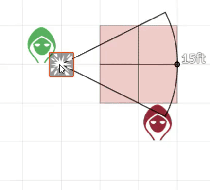

## D&D 5e Style Templates

The D&D 5e PHB states that an space touched by a spell's shape is affected, with the exception of Circular attacks (Sphere/Circle) in-which the square's center must be within the area of effect to targetted. Foundry by default instead uses requires the center of a square to be inside for ALL measure templates to be targetted.

When enabled, the Core Foundry template measurements will be overridden to follow D&D 5e's style of template targetting.

|Foundry Core|D&D 5e|
|:-:|:-:|
|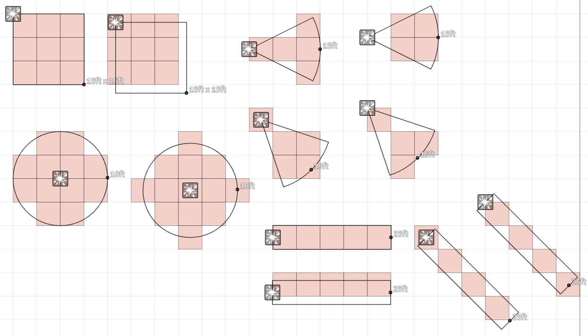|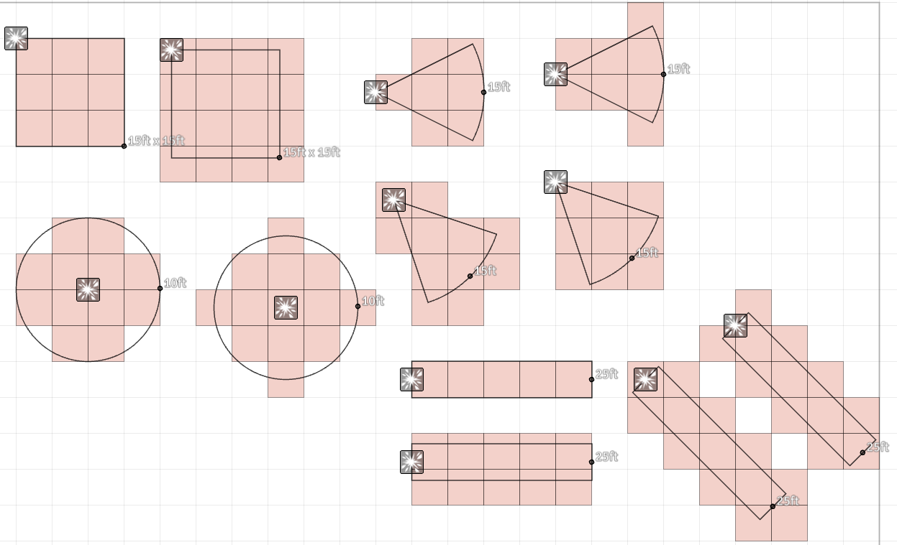|

## Quick Table Rolling

This is a very feature that adds a "Roll on the table" option to the context menu of RollTable entities. This allows you to roll the table without opening the Roll Table sheet and clicking the Roll button there.

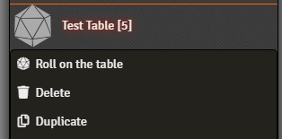

## Auto-Focus Text Box When Creating Entities

When creating an Entity (Actors, Items, Tables, Scenes, Folders, etc.) this will auto-select the Name text box so you don't have to click it. Just open the dialog and start typing! This will also affect any generic dialog that contains a Text box in it.

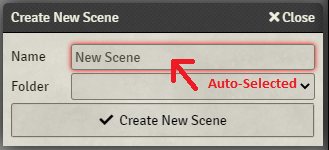

## Custom Folder Text Colours

Folders for the various entities can have custom background colours, but sometimes that colour does not contrast well with the unchanging text colour. This feature allows you to customize the text colour as well.

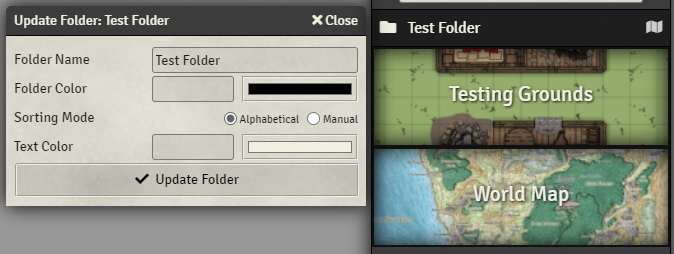

## Vehicle Cargo Capacity Unit

In the core D&D5e vehicle sheet, the cargo capacity is rigidly defined as a 2000 lb. Short Ton. This feature does away with that and gives you an option in the Vehicle Actor's sheet config to change that unit of measurement to either Long Tons (2240 lbs.), Short Tons (2000 lbs.), or Regular Pounds. I've made this one because of myt own frustrations. Tons is perfectly fine for a ship or vessel, but in most games, players are just using simple carts, wagons, and carriages. Those don't carry more than 1-2 S.Tons, so why have such a huge unit of measure?

This feature will also offer to conveniently convert the current cargo capacity to the new unit of measure. It also adds a simple label to the right of the Cargo Capacity to say which unit of measure is being used.

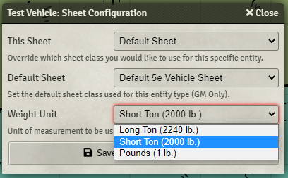
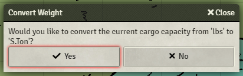
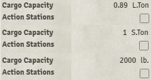

## Day/Night Transition Progress and Duration

Will now display a progress bar when you perform the animated transition between Day and Night. This is only shown to the GM and is useful to know when the animation has finished.

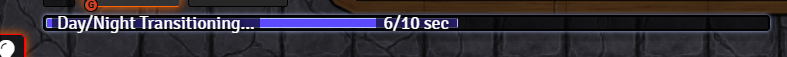

You can also now change the duration of the Day/Night transition. The FoundryVTT default is 10 seconds, but now you can adjust it between 1 and 60 seconds!

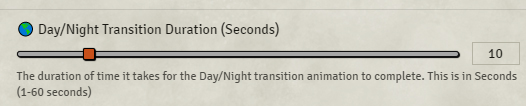

## Better Toggle Styling

The toggle buttons in the scene controls have the same look for both Hovering over with the mouse as when they are toggled on. This is frustrating as you cannot tell if the button is on or off while the mouse is hovering over it. Also, the difference between active and inactive is too subtle and is not easy to discern at a glance. This feature adds a distinct deeper purple colouring to the toggle when it is toggled on.

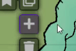

## Changelog

You can find all the latest updates [in the CHANGELOG](./CHANGELOG.md)