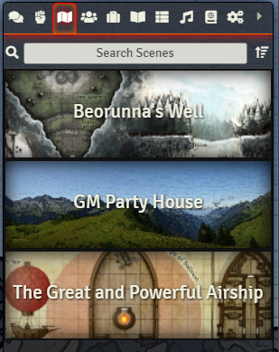
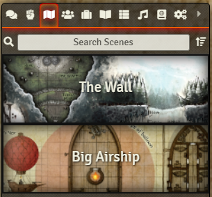
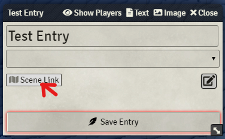
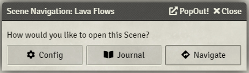
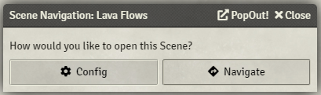
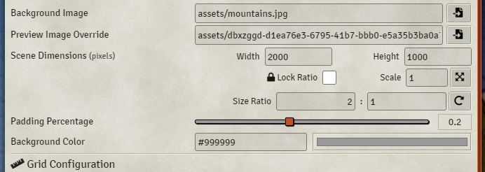

# DF Scene Enhancement

  

A few enhancements to scene management for players and GMs.

#####  If you want to support me or just help me buy doggy treats! Also, you can keep up to date on what I'm working on. I will be announcing any new modules or pre-releases there for anyone wanting to help me test things out!

## Scene Navigation on the Scenes Tab (Players & GMs)

This feature changes the behaviour of Scenes in the Scenes Tab. Now if you click on a scene, it will **navigate** to that scene instead of opening its configuration screen. Also, players will now see the Scenes tab as well and navigate to the scenes they have access to. This allows for the Navigation Bar to be much more reduced (especially for GMs). Now the Navigation Bar can be used as a fast shortcut section as it should be.

|GM View of Scenes Tab|Player View of Scenes Tab|
|:-:|:-:|
|||

## Scene Navigation from Scene Links in Journal Entries

This feature allows the user to navigate to a scene that is referenced inside of a Journal Entry. The current behaviour opens the scene's Configuration, but this will prompt the user with a dialog that offers Config and Navigate options.

|||
|:-:|:-:|
|||
|||
|| |

## Advanced Scene Dimensions

*Feature suggestion by @Damocles#7837*

Provides various features for more advanced Scene Dimension control.

- Apply scaler value against current dimensions.
- Changing dimensions will update scale based on the original values when sheet was opened.
- Lock dimension ratio, will automatically change one dimension when you change the other, maintaining the current aspect ratio to the nearest whole number.
- Automatically calculates the smallest fraction that represents the current ratio of the width and height whenever they change,and displays it in the "Size Ratio" fields.
- Set a custom ratio and apply it to the current dimensions. (Will preserve one of the dimensions, and just change the other to adhere to the new ratio).
- Clearing a dimension field will reveal the current image's original size for that dimension as placeholder/hint text.

### Compatibility

This module will work with any module that does not completely manipulate the Scenes Tab in the game. As of v3.0, there is one new module I am aware of that has similar features to what Scene Enhancement provides ([Scene Clicker](https://foundryvtt.com/packages/scene-clicker/)).

## Scene Thumbnail Override

This feature provides a Scene Thumbnail override. This is very useful if you wish to use a thumbnail image other than the one auto-generated by the system. You will find the new option in the Scene Configuration menu in the Appearance section.

## Featured on Baileywiki's Top 5 Quality of Life Modules

<a href="https://youtu.be/8D2fWmH_nlg" title="The Top 5 Quality of Life Modules for Foundry VTT">
  

    
  

</a>

### Contributors

- [Renato Innocenti](https://github.com/rinnocenti): Brazil Portuguese localization
- [José E. Lozano (Viriato139ac#0342)](https://github.com/lozalojo): Spanish localization
- @Damocles#7837: Scene Dimension Ratio Suggestion
- Touge & [BrotherSharper](https://github.com/BrotherSharper): Japanese Localization

## Changelog

You can find all the latest updates [in the CHANGELOG](./CHANGELOG.md)
