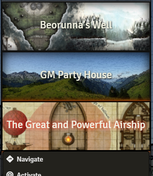
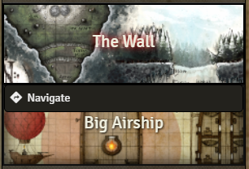

# DF Scene Enhancement
A few enhancements to scene management for players and GMs.

## Scene Navigation on the Scenes Tab (Players & GMs)

This feature changes the behaviour of Scenes in the Scenes Tab. Now if you click on a scene, it will **navigate** to that scene instead of opening its configuration screen. Also, players will now see the Scenes tab as well and navigate to the scenes they have access to. This allows for the Navigation Bar to be much more reduced (especially for GMs). Now the Navigation Bar can be used as a fast shortcut section as it should be.

|GM View of Scenes Tab|Player View of Scenes Tab|
|:-:|:-:|
|||
|||

### Compatibility
This module will work with any module that does not completely manipulate the Scenes Tab in the game. As of v1.2, I do not know of any module that replaces the Scenes Tab layout and so compatibility should be at 100%.

## Scene Thumbnail Override

This feature provides a Scene Thumbnail override. This is very useful if you wish to use a thumbnail image other than the one auto-generated by the system. You will find the new option in the Scene Configuration menu in the Appearance section.

## Contributions

- [Renato Innocenti](https://github.com/rinnocenti) - Localization: Brazil Portuguese