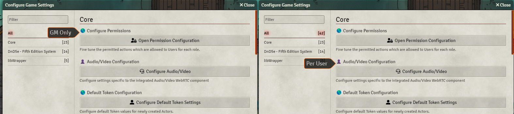
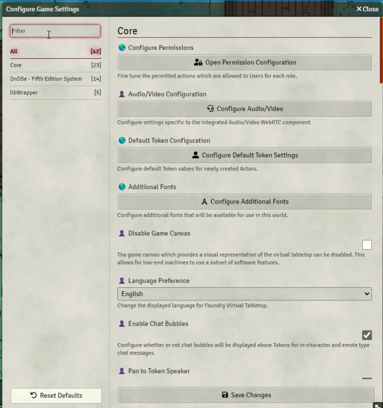

# DF Settings Clarity

  

This simple module provides a measure of clarity to the module configurations. It adds a tag to the start of each module settings' name that indicates if it is a `world` (GM Only) or a `client` (Per User) setting. This is very useful for GM to know which settings the users can see, and which ones only the GM can see. Also it can help clear up confusion when the GM is helping a player setup their settings.

## Settings Search

*Powered by [fuzzysort](https://github.com/farzher/fuzzysort)*
Adds a new search box that performs a Fuzzy Search to try and help you find the settings you need.

#####  If you want to support me or just help me buy doggy treats! Also, you can keep up to date on what I'm working on. I will be announcing any new modules or pre-releases there for anyone wanting to help me test things out!

## Contributors

- [José E. Lozano (Viriato139ac#0342)](https://github.com/lozalojo): Spanish localization