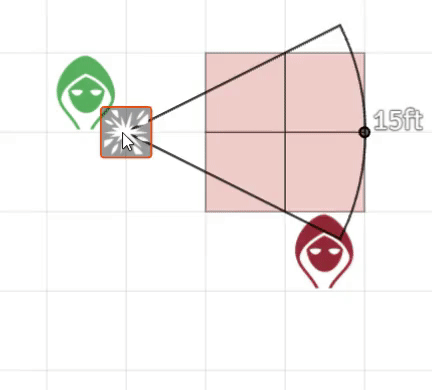
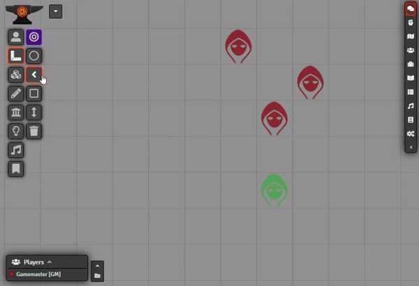
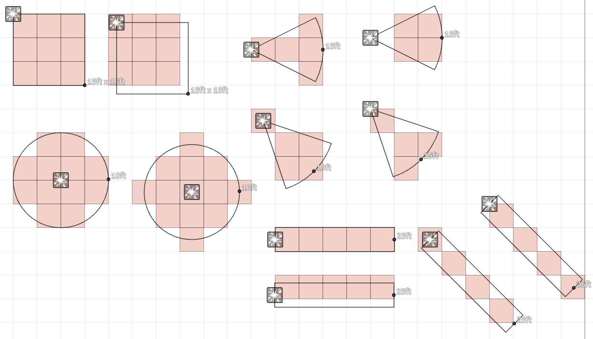

# DF Template Enhancements

Various enhancements to the FoundryVTT Templates layer. This brings different forms of template grid highlighting and auto-targetting features.

#####  If you want to support me or just help me buy doggy treats! Also, you can keep up to date on what I'm working on. I will be announcing any new modules or pre-releases there for anyone wanting to help me test things out!

## Contributers

- Touge & [BrotherSharper](https://github.com/BrotherSharper): Japanese Localization

## Auto-Target Tokens with Template

If enabled, templates will automatically mark tokens that are inside the template area of effect as "Targetted". This is very useful for quickly placing spell templates and be able to apply the spells affect to the targeted tokens.

## Template Preview

If enabled, templates will now actively update the grid highlighting and auto-targetting (if auto-target is on) whil moving the template around the scene, or whil creating a new template. This helps a lot when placing a new template and your players are trying to place it in a particular spot in an attempt to optimize their spell's impact.

## D&D 5e Style Templates

The D&D 5e PHB states that an space touched by a spell's shape is affected, with the exception of Circular attacks (Sphere/Circle) in-which the square's center must be within the area of effect to targetted. Foundry by default instead uses requires the center of a square to be inside for ALL measure templates to be targetted.

When enabled, the Core Foundry template measurements will be overridden to follow D&D 5e's style of template targetting. There is also an option to revoke the Circle Template's rule exception and behave the same as the rest, hitting any square it touches.

|Foundry Core|D&D 5e|
|:-:|:-:|
|||
