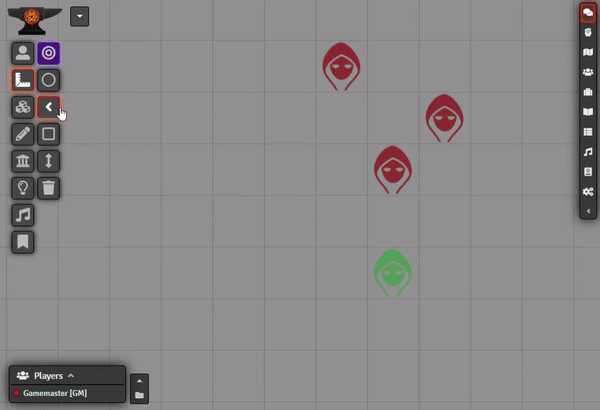
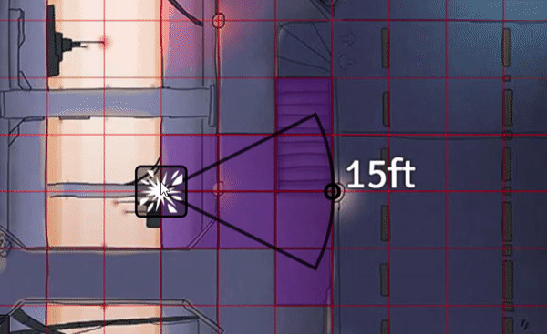
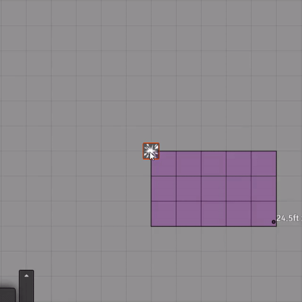
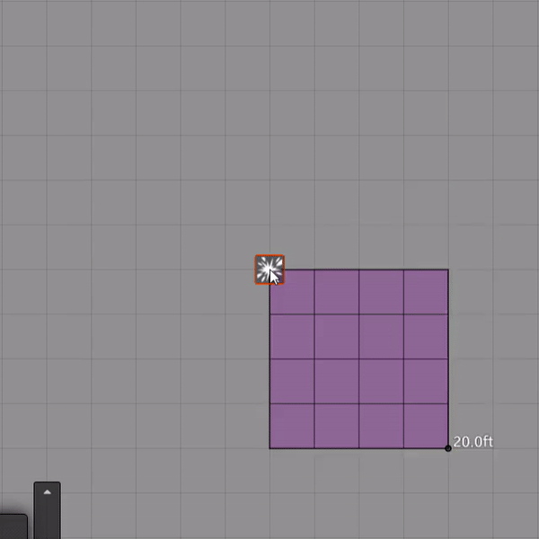
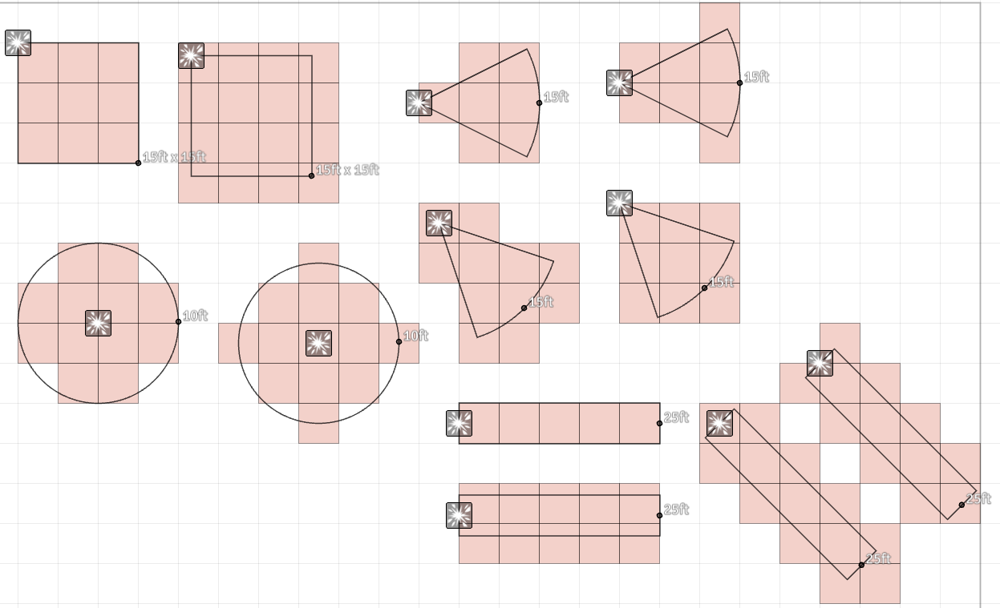

# DF Template Enhancements

Various enhancements to the FoundryVTT Templates layer. This brings different forms of template grid highlighting and auto-targetting features.

#####  If you want to support me or just help me buy doggy treats! Also, you can keep up to date on what I'm working on. I will be announcing any new modules or pre-releases there for anyone wanting to help me test things out!

## Contributers

- Touge & [BrotherSharper](https://github.com/BrotherSharper): Japanese Localization

## Auto-Target Tokens with Template

If enabled, templates will automatically mark tokens that are inside the template area of effect as "Targetted". This is very useful for quickly placing spell templates and be able to apply the spells affect to the targeted tokens. Auto-targeting also works on Gridless scenes by generating a series of points over each token and detecting if any of the token's points are within the template area. The number of points used per grid square is configurable in the settings.

## Template Preview

If enabled, templates will now actively update the grid highlighting and auto-targetting (if auto-target is on) whil moving the template around the scene, or whil creating a new template. This helps a lot when placing a new template and your players are trying to place it in a particular spot in an attempt to optimize their spell's impact.

## Snap to Grid Intersections

If enabled, template origins will snap to grid intersections. Some rules systems (such as D&D 5e) state that spell templates should originate from a grid intersection.

## Custom Angle Snaps

FoundryVTT defaults to 24 macro snap points and 72 micro snap points when rotating a template. These can sometimes bog down combat when some players may spend too much time trying to rotate the template perfectly. This feature allows you to adjust the number of macro snap points available when rotating a template with the mouse wheel, as well as the multiplier used to generate the micro snap points. I recommend using 8 macro snap points with a micro multiplier of 2 (16 micro snaps) for simplest rotation while not limiting players too much.

## Square Template Rotation Correction

The core Square Template is hard fixed to the X,Y axes and cannot be rotated. Rotating the template simply changes the shape of the template, which is unnecessary since the Ray template can provide an easier way to create a rectangle. If enabled, square templates will stay perfectly square and rotate that square around the origin point.

|FoundryVTT Core Behaviour|Corrected Behaviour|Corrected Behaviour for D&D 5e|
|:-:|:-:|:-:|
||||

## D&D 5e Style Templates

The D&D 5e PHB states that an space touched by a spell's shape is affected, with the exception of Circular attacks (Sphere/Circle) in-which the square's center must be within the area of effect to targetted. Foundry by default instead uses requires the center of a square to be inside for ALL measure templates to be targetted.

When enabled, the Core Foundry template measurements will be overridden to follow D&D 5e's style of template targetting. There is also an option to revoke the Circle Template's rule exception and behave the same as the rest, hitting any square it touches.

|Foundry Core|D&D 5e|
|:-:|:-:|
|||
