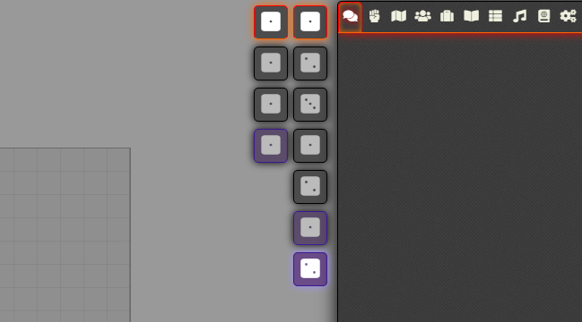

# DragonFlagon Module Buttons Library

  [](https://www.foundryvtt-hub.com/package/lib-df-buttons/)

Library for Foundry VTT module developers to use. It allows modules to register control buttons that appear on the right side of the screen.



##### [](https://www.patreon.com/bePatron?u=46113583) If you want to support me or just help me buy doggy treats! Also, you can keep up to date on what I'm working on. I will be announcing any new modules or pre-releases there for anyone wanting to help me test things out!

# For Module Developers

## How to Use

All modules that wish to use the library should declare a dependency in their manifest as follows:

```json
"dependencies": [ { "name": "lib-df-buttons" } ]
```

## How to Register Buttons

The library uses Hooks in the same way that the `SceneControls` class does. This Hook call receives a list of `ToolGroup` objects which can be appended to.

```JavaScript
Hooks.on('getModuleToolGroups', (controlManager/*: ControlManager*/, groups /*: ToolGroup[]*/) => {
	groups.push({
		name: 'my-tool-group',// Unique group ID
		icon: '<i class="fas fa-dice-one"></i>',// HTMLElement to be used as an Icon
		title: 'My Tool Group',// Plain text or a localization key
		tools: [
			{
                name: 'my-tool',// Unique tool ID within the scope of the parent Group
            	title: 'My Special Tool',// Plain text or a localization key
                onClick: () => console.log("I've been clicked!"),// Click handler
                icon: '<i class="fas fa-dice-one"></i>',// HTMLElement to be used as an Icon
                button: true // This tool is just a button
            },
			...
		]
	});
});
```

By default, all `ToolGroup` and `Tool` configurations use a Radial Behaviour. This can be changed by setting either `button: true` or `toggle: true`.

## Configuration Interfaces

```TypeScript
/**
 * Tool Configuration for tools that appear on the secondary bar when their
 * parent group is active.
 */
export interface Tool {
	/** Unique name ID of the Tool */
	name: string;
	/** Plain Text or a Localization Key */
	title: string;
	/** HTMLElement to be used as an icon */
	icon: string;
	/**
	 * (default: false) If true, the tool will act as a simple button.
	 * Must implement {@link onClick}
	 */
	button?: boolean | false;
	/**
	 * (default: false) If true, the tool will act as a toggle button.
	 * Must implement {@link onClick}
	 */
	toggle?: boolean | false;
	/**
	 * (default: undefined) If {@link toggle} is true, this holds the toggle
	 * button's state
	 */
	active?: boolean | undefined;
	/**
	 * (default: true) Sets the visibility of the tool. Can be a function or a
	 * boolean value
	 */
	visible?: () => boolean | boolean | true;
	/**
	 * A click handler that is invoked when ever the tool is pressed. This
	 * function is given an `active` state when either the default Radial or set
	 * as a toggle button.
	 * 
	 * If the Handler is unbound, it will be bound to the {@link Tool} instance it belongs to.
	 * 
	 * - Radial Button (default): Invoked with `active:false` when deactivated, or `active:true` when activated.
	 * - Toggle Button: Invoked with the new toggled state (true|false).
	 * - Button: Invoked with no parameters.
	 */
	onClick?: (active?: boolean) => void | null | undefined;
}
/**
 * A collection of Tools that appear on the main bar
 */
export interface ToolGroup extends Tool {
	/** {@link Tool} collection */
	tools?: Tool[];
	/**
	 * {@link Tool.name} of tool to be active. Defaults to the first tool in
	 * the {@link tools} list.
	 */
	activeTool?: string;
}
```

## Hooks

This library leverages the Hooks system for all of its interactions. This makes it easier for developers to register Tools/ToolGroups, or to listen to when groups or tools are activated. As well as to activate a Tool or ToolGroup programmatically.

### Hooks that are broadcast

```typescript
/* Pre-ToolGroup populator. Invoked immediately before `getModuleToolGroups` */
Hooks.on('getModuleToolGroupsPre', (app: ControlManager, groups: ToolGroup[]) => {});
/* General request used to populate the list of Tool Groups and their collections of Tools */
Hooks.on('getModuleToolGroups', (app: ControlManager, groups: ToolGroup[]) => {});
/* Post-ToolGroup populator. Invoked immediately after `getModuleToolGroups` */
Hooks.on('getModuleToolGroupsPost', (app: ControlManager, groups: ToolGroup[]) => {});
/* Broadcast when a group has been activated, and the activated `ToolGroup` instance is passed to it */
Hooks.on('toolGroupActivated', (app: ControlManager, groups: ToolGroup[]) => {});
/* Broadcast when a Tool has been activated, and the parent `ToolGroup` and activated `Tool` instances are passed to it */
Hooks.on('toolActivated', (app: ControlManager, groups: ToolGroup[]) => {});
```
### Hooks that are monitored
```typescript
/* Invoking this Hook will tell the ControlManager to activate the named ToolGroup */
Hooks.call('activateGroupByName', "my-group-name");
/* Invoking this Hook will tell the ControlManager to activate the named Tool that
 * belongs to the named ToolGroup. You can also pass `true` as a 3rd parameter to
 * have the ToolGroup also activated. (default: false)
 */
Hooks.call('activateToolByName', "my-group-name", "my-tool-name", true);
/* Invoking this Hook will cause the ControlManager destroy the current ToolGroup
 * collection and re-build it, calling `getModuleToolGroupsPre`, `getModuleToolGroups`,
 * and `getModuleToolGroupsPost` as before. It then renders the new list of ToolGroups.
 */
Hooks.call('reloadModuleButtons');
```