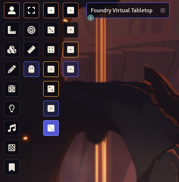

# DragonFlagon Module Buttons Library

> [!IMPORTANT]
>  **ALL DragonFlagon Modules are made AI-Free**

  [](https://www.foundryvtt-hub.com/package/lib-df-buttons/)

Library for Foundry VTT module developers to use. It allows modules to register control buttons that appear on the right side of the screen.



##### [](https://www.patreon.com/bePatron?u=46113583) If you want to support me or just help me buy doggy treats! Also, you can keep up to date on what I'm working on. I will be announcing any new modules or pre-releases there for anyone wanting to help me test things out!

# For Module Developers

## How to Use

All modules that wish to use the library should declare a dependency in their manifest as follows:

```json
"dependencies": [ { "name": "lib-df-buttons" } ]
```

## How to Register Buttons

The library uses Hooks in the same way that the `SceneControls` class does. This Hook call constructs an object where each unique property is a `Tool` object.

```JavaScript
Hooks.on('getModuleTools', (controlManager/*: ControlManager*/, tools /*: Record<string, Tool>*/) => {
	tools.my_tool = {
		icon: 'fas fa-dice-one',// Font Awesome class list for your desired icon
		title: 'My Tool',// Plain text or a localization key
		type: 'radial',
		tools: {
			sub_tool: {
            	title: 'My Special Tool',// Plain text or a localization key
                onClick: () => console.log("I've been clicked!"),// Click handler
                icon: '<i class="fas fa-dice-one"></i>',// HTMLElement to be used as an Icon
                type: 'button' // This tool is just a button
            },
			...
		}
	};
});
```

By default, all `Tool` configurations use a Radial Behaviour. This can be changed by setting type to either `'button'` or `'toggle'`.

## Configuration Interfaces

```TypeScript
/** Standard single parameter handler */
export type Handler<T> = (value?: T) => (Promise<void> | void);

/** Standard boolean logic predicate */
export type Predicate = () => (Promise<boolean> | boolean);
/**
 * Tool Configuration for tools that appear on the secondary bar when their
 * parent group is active.
 */
export interface Tool {
	/** Plain Text or a Localization Key */
	title: string;
	/** HTMLElement to be used as an icon */
	icon: string;
	/**
	 * (default: 'radial') The type of tool can be a button, toggle, or radial.
	 * 
	 * |    Type    |  `onClick` |   `tools`  |
	 * |------------|------------|------------|
	 * | `'button'` | `required` |  `ignored` |
	 * | `'toggle'` | `required` |  `ignored` |
	 * | `'radial'` | `optional` | `optional` |
	 */
	type: 'button' | 'toggle' | 'radial';
	/**
	 * (default: null) Used to add your own custom class name to the generated
	 * button HTML.
	 */
	class?: string | null;
	/**
	 * (default: false) Indicates your button or {@link ToolGroup} should be
	 * allowed to render when there is no game board canvas.
	 */
	noCanvas?: boolean;
	/**
	 * (default: false) If {@link toggle} is true, this holds the toggle
	 * button's state. If {@link toggle} and {@link button} are false, this
	 * holds the activation state of the control and will be overridden by the
	 * {@link ControlManager}.
	 */
	isActive?: Predicate | boolean | null;
	/**
	 * (default: true) If true, the tool will be visible and interactive. If
	 * false, the tool will be hidden, and will not be interactive.
	 */
	enabled?: Predicate | boolean | null;
	/**
	 * A collection of tools that represents a sub-menu of this tool that
	 * will display to the right if this tool is selected.
	 * 
	 * > **Radial tools only, will otherwise be ignored for buttons and toggles.**
	 */
	tools?: Record<string, Tool>;
	/**
	 * A special field that allows the control to be interacted with
	 * programmatically, but not drawn in the menu UI.
	 */
	hidden?: true;
	/**
	 * A click handler that is invoked when ever the tool is pressed. This
	 * function is given an `active` state when either the default Radial or set
	 * as a toggle button.
	 * 
	 * If the Handler is unbound, it will be bound to the {@link Tool} instance it belongs to.
	 * 
	 * - Radial Button (default): Invoked with `active:false` when deactivated, or `active:true` when activated.
	 * - Toggle Button: Invoked with the new toggled state (true|false).
	 * - Button: Invoked with no parameters.
	 */
	onClick?: Handler<boolean> | null;
}

/** Manages the button UI, Hooks, and User Interactions. */
export interface ControlManager {
	/** The primary tool set. */
	get tools(): Record<string, Tool>;
	/**
	 * Activates a {@link Tool} at some level within the Tool stack via their unique names.
	 * @param path A string containing a path to the sub-menu of the tool using
	 *             the unique names provided for each tool. ie: "my-tool-group.my-sub-tool".
	 * @param activateParents (Default true) Also activate the parent {@link Tool}s in the path.
	 */
	activateToolByPath(path: string, activateParents?: boolean): Promise<void>;
	/** Reload the module buttons bar by rebuilding the {@link ToolGroup}s and rerendering. */
	reloadModuleButtons(): void;
	/** Refresh the button UI to reflect any external changes made */
	refresh(): void;
}
```

## Hooks

This library leverages the Hooks system for all of its interactions. This makes it easier for developers to register Tools/ToolGroups, or to listen to when groups or tools are activated. As well as to activate a Tool or ToolGroup programmatically.

### Hooks that are broadcast

```typescript
/* Pre-Tools populator. Invoked immediately before `getModuleTools` */
Hooks.on('getModuleToolsPre', (app: ControlManager, groups: ToolGroup[]) => {});
/* General request used to populate the set of Tools. */
Hooks.on('getModuleTools', (app: ControlManager, groups: ToolGroup[]) => {});
/* Post-Tools populator. Invoked immediately after `getModuleTools` */
Hooks.on('getModuleToolsPost', (app: ControlManager, groups: ToolGroup[]) => {});
/* Broadcast when a request has been made to tear down and rebuild the module
 * buttons. Called whenever `ControlManager.reloadModuleButtons()` is invoked
 */
Hooks.on('moduleButtonsReloading', (app: ControlManager) => {});
```
### Hooks that are monitored
```typescript
/* Invoking this Hook will tell the ControlManager to activate the named Tool at
 * the provided path. By default, it will also activate the parent radial tools
 * along the path. If you wish to avoid this, you will need to call the function
 * directly via `ui.moduleControls.activateToolByPath(path, false)`
 */
Hooks.call('activateToolByPath', "my_tool.sub_tool");
/* Invoking this Hook will cause the ControlManager destroy the current Tool set
 * and re-build it. Calling `getModuleToolsPre`, `getModuleTools`, and
 * `getModuleToolsPost` as before. It then renders the new list of Tool menus.
 */
Hooks.call('reloadModuleButtons');
/* Invoking this Hook will redraw the menus to reflect any changes that may have
 * occurred in the Tool set.
 */
Hooks.call('refreshModuleButtons');
```