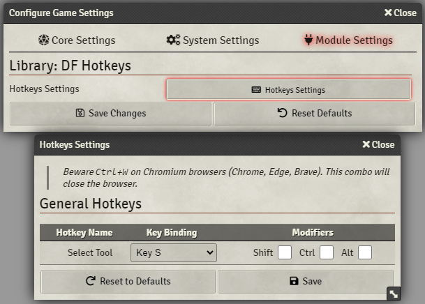
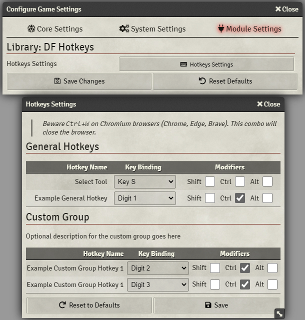

# DragonFlagon Hotkeys Library

Library for Foundry VTT module developers to use. It allows modules to register their own Keyboard Shortcuts and gives way for users to then customize those hotkey bindings.

This module comes with a single hotkey pre-assigned for the Select Tool mapped to the `S` key.



## Example of Hotkeys

Here is an example of hotkeys registered to both the General group, and a Custom Group



## Contributors

- Touge: Japanese localization
- [lozalojo](https://github.com/lozalojo): Spanish localization

##### [](https://www.patreon.com/bePatron?u=46113583) If you want to support me or just help me buy doggy treats! Also, you can keep up to date on what I'm working on. I will be announcing any new modules or pre-releases there for anyone wanting to help me test things out!

# For Module Developers

- [How to Use](#How-to-Use)
	- [Check if Hotkeys Library is Active](#Check-if-Hotkeys-Library-is-Active)
	- [For TypeScript Projects](#For-TypeScript-Projects)
	- [Important Data Types](#Important-Data-Types)
	- [Register Hotkey](#Register-Hotkey)
	- [Register a Group](#Register-a-Group)
- [Shim](#Shim)
	- [How to Use](#How-to-Use-Shim)
	- [For TypeScript Devs](#For-the-Fellow-TypeScript-Devs)

## How to Use

All modules that wish to use the library should declare a dependency in their manifest as follows:

```json
"dependencies": [ { "name": "lib-df-hotkeys" } ]
```

### Check if Hotkeys Library is Active

At some point before you attempt to register hotkeys, you should check to make sure the module is both installed, and active in the current world. To do that, here is a Code Snippet you can use to present an error message if the library is missing.

```JavaScript
Hooks.once('ready', function() {
	if (!game.modules.get('lib-df-hotkeys')?.active) {
		console.error('Missing lib-df-hotkeys module dependency');
		if (game.user.isGM)
			ui.notifications.error("'My Module' requires the 'Library: DF Hotkeys' module. Please install and activate this dependency.");
		// Perform alternative code to handle missing library
		return;
	}
	// Perform your Hotkey registrations
});
```

[top](#For-Module-Developers)

---

### For TypeScript Projects

You will find the Typing Definitions file `lib-df-hotkeys.d.ts` in the [latest release](https://github.com/flamewave000/dragonflagon-fvtt/releases/tag/lib-df-hotkeys_2.3.3) that you can include in your project.

---

### Important Data Types

```typescript
/** Simple KeyMap for a Hotkey */
declare interface KeyMap {
	/** The key code to be listned for */
	key: string | String;
	/** Does the Alt key need to be pressed at the same time? */
	alt: boolean;
	/** Does the Ctrl key need to be pressed at the same time? */
	ctrl: boolean;
	/** Does the Shift key need to be pressed at the same time? */
	shift: boolean;
}

/** Hotkey Configuration Registration */
declare interface HotkeySetting {
	/** optional: Group to be included in with their own header. Default: General Group */
	group?: string | String;
	/** Unique variable name to be used in the layout. Recommend: 'module-name.myHotkey' */
	name: string | String;
	/** Label to be displayed in the layout. This will be localized when injected into the HTML */
	label: string | String;
	/**
	* Accept repeated KeyDown events, this occurs if the user is holding the key down, it will
	* send additional events that are spaced out according to the user's key press repeat settings.
	*/
	repeat?: boolean;
	/** The default setting for this hotkey, can be a static KeyMap, or a function that returns the default. */
	default: KeyMap | (() => KeyMap);
	/** Function for retrieving the current hotkey setting. If defined, you must also provide a `set` function. */
	get?(): KeyMap;
	/** Function for saving the new hotkey setting. If defined, you must also provide a `get` function */
	set?(value: KeyMap): Promise<KeyMap>;
	/** Function to handle the execution of the hotkey */
	/** @deprecated Use HotkeySetting.onKeyDown and HotkeySetting.onKeyUp */
	handle?(self: HotkeySetting): void;
	/**
	* Function to handle the execution of the Hot Key Down event.
	* @param self Convenience reference to this HotkeySetting object
	* @param repeated	Optional: This will only be defined if `repeat: true` has been set.
	* 					It will be false on the first Key Down event, but true on any subsequent
	* 					Key Down events caused by the user holding the key down.
	*/
	onKeyDown?(self: HotkeySetting, repeated?: boolean): void;
	/**
	* Function to handle the execution of the Hot Key Up event.
	* @param self Convenience reference to this HotkeySetting object
	*/
	onKeyUp?(self: HotkeySetting): void;
}

/** Hotkey Group Configuration */
declare interface HotkeyGroup {
	/** Unique name of the group. */
	name: string | String;
	/** Displayed in the HTML header for the group. */
	label: string | String;
	/** Optional description of the group */
	description?: string | String;
}
```

[top](#For-Module-Developers)

---

### Register Hotkey

To register a new Hotkey, simply add the following to your code. It must be during or after the `init` event. If you add a hotkey that has the same name as one that has already been registered, it will by default throw an error. If you do not wish an error to be thrown, you can pass `false` to the `throwOnError` parameter and it will instead simply return `true` for success and `false` on error.

```JavaScript
// JavaScript Implementation
Hooks.once('init', function() {
	/* Hotkeys.registerShortcut(config: HotkeySetting): void */
	hotkeys.registerShortcut({
		name: 'my-module.my-hotkey', // <- Must be unique
		label: 'My Hotkey',
		get: () => game.settings.get('my-module', 'my-hotkey'),
		set: async value => await game.settings.set('my-module', 'my-hotkey', value),
		default: () => { return { key: hotkeys.keys.KeyQ, alt: false, ctrl: false, shift: false }; },
		onKeyDown: self => { console.log('You hit my custom hotkey!') },
	});
    /* Hotkeys.registerShortcut(config: HotkeySetting, throwOnError?: boolean): boolean */
    hotkeys.registerShortcut({...}, false);
});
```

```typescript
// TypeScript Implementation
Hooks.once('init', function() {
	/* Hotkeys.registerShortcut(config: HotkeySetting): void */
	hotkeys.registerShortcut({
		name: 'my-module.my-hotkey', // <- Must be unique
		label: 'My Hotkey',
		get: () => game.settings.get('my-module', 'my-hotkey'),
		set: async (value: KeyMap) => await game.settings.set('my-module', 'my-hotkey', value),
		default: () => { return { key: hotkeys.keys.KeyQ, alt: false, ctrl: false, shift: false }; },
		onKeyDown: (self: HotkeySetting) => { console.log('You hit my custom hotkey!') },
	});
    /* Hotkeys.registerShortcut(config: HotkeySetting, throwOnError?: boolean): boolean */
    hotkeys.registerShortcut({...}, false);
});
```

[top](#For-Module-Developers)

---

### Register a Group

This is only recommended if you have multiple hotkeys to group together. Otherwise hotkeys are added to the General Hotkeys section. If you add a group that has the same name as one that has already been registered, it will by default throw an error. If you do not wish an error to be thrown, you can pass `false` to the `throwOnError` parameter and it will instead simply return `true` for success and `false` on error.

```JavaScript
// JavaScript Implementation
Hooks.once('init', function() {
	// You must register the group before adding hotkeys to it
	/* Hotkeys.registerGroup(group: HotkeyGroup): void */
	hotkeys.registerGroup({
		name: 'my-module.my-group', // <- Must be unique
		label: 'My Awesome Group',
		description: 'Optional description goes here' // <-- Optional
	});
	/* Hotkeys.registerGroup(group: HotkeyGroup, throwOnError?: boolean): boolean */
	hotkeys.registerGroup({...}, false);

	/* Hotkeys.registerShortcut(config: HotkeySetting, throwOnError?: boolean) */
	hotkeys.registerShortcut({
		name: 'my-module.my-hotkey', // <- Must be unique
		label: 'My Hotkey',
		group: 'my-module.my-group', // <- target your custom group
		get: () => game.settings.get('my-module', 'my-hotkey'),
		set: async value => await game.settings.set('my-module', 'my-hotkey', value),
		default: () => { return { key: hotkeys.keys.KeyQ, alt: false, ctrl: false, shift: false }; },
		onKeyDown: self => { console.log('You hit my custom hotkey!') },
	});
});
```

```typescript
// TypeScript Implementation
Hooks.once('init', function() {
	// You must register the group before adding hotkeys to it
	/* Hotkeys.registerGroup(group: HotkeyGroup): void */
	hotkeys.registerGroup({
		name: 'my-module.my-group', // <- Must be unique
		label: 'My Awesome Group',
		description: 'Optional description goes here' // <-- Optional
	});
	/* Hotkeys.registerGroup(group: HotkeyGroup, throwOnError?: boolean): boolean */
	hotkeys.registerGroup({...}, false);

	/* Hotkeys.registerShortcut(config: HotkeySetting, throwOnError?: boolean) */
	hotkeys.registerShortcut({
		name: 'my-module.my-hotkey', // <- Must be unique
		label: 'My Hotkey',
		group: 'my-module.my-group', // <- target your custom group
		get: () => game.settings.get('my-module', 'my-hotkey'),
		set: async (value: KeyMap) => await game.settings.set('my-module', 'my-hotkey', value),
		default: () => { return { key: hotkeys.keys.KeyQ, alt: false, ctrl: false, shift: false }; },
		onKeyDown: (self: HotkeySetting) => { console.log('You hit my custom hotkey!') },
	});
});
```

[top](#For-Module-Developers)

### Show Your Own Config Menu

The standard library will have a menu button in the module configuration settings that displays ALL of the registered hotkey settings. This can get very cluttered. The library provides a way for you to display your own dialog containing only the settings and groups that you want to show. This is done through a set of filters, and you provide your own title for the config window's titlebar.

*Note: This feature is not available in the Shim, please check if "Library: DF Hotkeys" is activated before trying to use this*

#### How to show a config

The way to do this, is to call `Hotkeys.showConfig(title: string, filters: [])` as shown here:

```javascript
await Hotkeys.showConfig('My Title', ['my-module.my-group']);
```

This will display the config menu and only show the settings assigned to the group with the id: `my-module.my-group`.

#### How to get a config constructor

For the purposes of registering your own Menus in FoundryVTT, you need to provide the registrar an actual "Constructor" of a FormApplication for it to instantiate on your behalf. You will find the `Hotkeys.createConfig(...)` function will give you that.

```javascript
game.settings.registerMenu('my-module-name', {
	name: 'My Hotkeys!'
	type: Hotkeys.createConfig('My Title', ['my-module.my-group']),
});
```

#### Complex Filtering

I've likely way over-engineered this filtering mechanism, but alas, I had fun...🤣

You can do much more complex filtering with intermixed Regular Expressions, and additional Hotkey Filtering within groups via exact name match or Regular Expression matching. Please be aware that filters are INCLUSIVE, this means that a group/hotkey only needs to successfully match against one filter pattern to be included.

```javascript
await Hotkeys.showConfig('My Fancy Config',[
	// You can mix exact group names with regex
	'df-curvy-walls', // these will all match
	'df-curvy.+',     // the same group
	/df-cur.+/,       // RegExp objects are also allowed
	// You can also perform matches on the hotkeys within a group themselves
	{
		group: 'df-curvy-walls',
		hotkeys: [ 'df-curvy-walls.apply', 'df-curvy-walls.cancel' ]
	},
	{
		// You can also use regex to apply the filter to multiple groups
		group: 'df-curvy-.+',
		// these hotkey names can also be regex strings or RegExp objects
		hotkeys: [
			/.+\.(in|de)crement/,
            '.+\\.(in|de)crement'
		]
	},
	// You can also include options from the default "general" group
	{ group: 'general', hotkeys: [...] }
]);
```

For a full understanding of the filter parameter, you can find the Type Definition for the function call here:

```TypeScript
export interface GroupFilter {
	group: string | RegExp;
	hotkeys: (string | RegExp)[];
}
class Hotkeys {
	static async showConfig(title: string, filters: (string | RegExp | GroupFilter)[])
}
```


---

## Shim

**Requires your module use `esmodules` in its manifest file** 

### How to Use Shim

If you reeeeaaaallly don't want to add a dependency to your module manifest, you can include the generated Shim into any module. What this shim does is provide the core functionality of the Hotkeys Library. This means you can register hotkeys and such as normal, but the difference is that users will not be able to customize the assigned hotkeys. It will also perfectly integrate into the actual Hotkeys module as well. It does this by first checking if Hotkeys already exists in the Global namespace. If it does exist, it will simply return a reference to that global Hotkeys library definition. Otherwise, it will return the shim version.

First you need to add the shim file `lib-df-hotkeys.shim.js` to your project.
You will find this file in the latest release for [Library: DF Hotkeys](https://github.com/flamewave000/dragonflagon-fvtt/releases/tag/lib-df-hotkeys_2.3.3)

Next you will need to simply import the hotkeys shim in which ever JavaScript/TypeScript module files you intend to use it.

```javascript
import { hotkeys } from './lib/lib-df-hotkeys.shim.js';

Hooks.once('init', function() {
	hotkeys.registerShortcut({
		name: 'my-module-name.my-shortcut',
		label: 'MY_MODULE_NAME.MyShortcutLabel`,
		default: { key: hotkeys.keys.KeyA, alt: false, ctrl: false, shift: false },
		onKeyDown: () => console.log('Whoa! it worked without the library activated!')
	});

	/** If you want to use the Custom Config feature,
	 * you will need to check if the actualy Hotkeys
	 * library module is activated. You can quickly
	 * check using the following:
	 */
	if (hotkeys.isShim !== true) {
		game.settings.registerMenu('my-module-name', {
			name: 'My Hotkeys!'
			type: Hotkeys.createConfig('My Title', ['my-module.my-group']),
		});
	}
});
```

### For the Fellow TypeScript Devs

There is also a Type Definition file for the Shim that you can include in your project to get those delicious typings!
You will find this file (`lib-df-hotkeys.shim.d.ts`) in the latest release for [Library: DF Hotkeys](https://github.com/flamewave000/dragonflagon-fvtt/releases/tag/lib-df-hotkeys_2.3.3)

[top](#For-Module-Developers)
